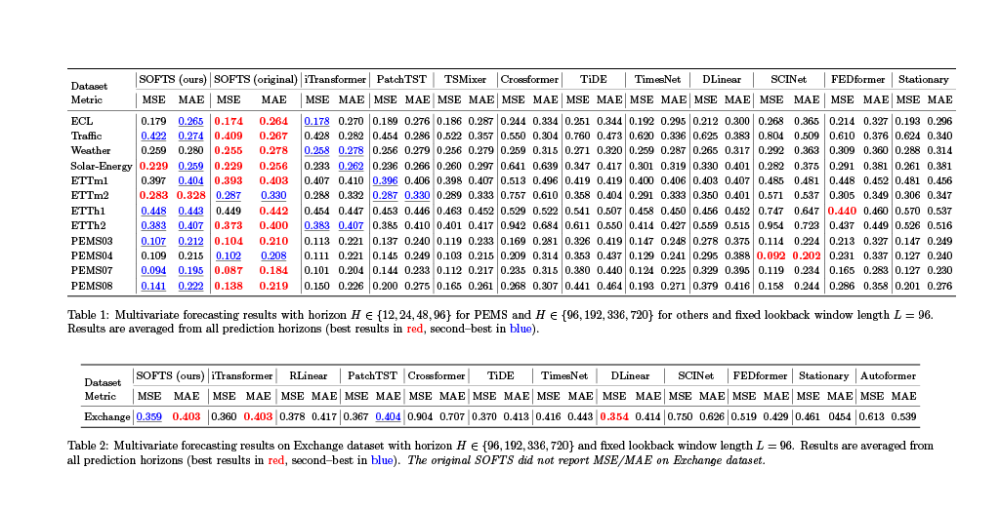

## Reimplementation of *SOFTS: Efficient Multivariate Time Series Forecasting with Series-Core Fusion* (NeurIPS 2024).

|   Name  |  GitHub  |  Login |
|:-------:|:--------:|:-------:|
| Letian Shen | syd-mbv | lshen33 |
| Tianxi Lu   | degeneratorL | tlu44 |
| Yinan Zhai  | Kyle-zhai  | yzhai20 |
## Introduction
In this project, we reproduce and evaluate the model proposed in the paper [*SOFTS: Efficient Multivariate Time Series Forecasting with Series-Core Fusion*](https://github.com/Secilia-Cxy/SOFTS/tree/main). The original work introduces a simple yet powerful architecture for multivariate time series forecasting that leverages a centralized interaction module called STAR (STar Aggregate-Redistribute).

The broader context of the problem lies in two common modeling paradigms: *channel-independent* and *channel-dependent* forecasting methods. Channel-independent methods process each univariate series separately, offering strong robustness against non-stationary data but lacking inter-channel interaction modeling. In contrast, channel-dependent methods enhance performance by modeling dependencies across time series, often using attention-based mechanisms, but at the cost of increased computational complexity and reduced robustness in noisy scenarios.

Our goal is to faithfully reproduce the SOFTS framework and assess its performance across multiple public datasets. Additionally, we document the challenges encountered during implementation, particularly in dataset transformation and preprocessing.

  <!-- - Objectives: Effectively integrating the robustness of channel independence and utilizing the correlation between channels in a simpler and more efficient manner is crucial for building better time series forecasting models.
  - The paper makes the following 3 contributions:
      1.  Presents Series-cOre Fused Time Series (SOFTS) forecaster, a a simple MLP-based model that demonstrates state-of-the-art performance with lower complexity.
      2.  Introduces the  STar Aggregate-Redistribute (STAR) module, which serves as the foundation of SOFTS. STAR is designed as a centralized structure that uses a core to aggregate and exchange information from the channels. Compared to distributed structures like attention, the STAR not only reduces the complexity but also improves robustness against anomalies in channels.
      3.  Through extensive experiments, the effectiveness and scalability of SOFTS are validated. The universality of STAR is also validated on various attention-based time series forecasters. -->

## Methodology
We re-implemented the SOFTS architecture following the original paper. The core of SOFTS is the STAR module, which is designed to replace pairwise channel interactions (commonly used in attention mechanisms) with a centralized core vector.

Specifically, each channel’s representation is first encoded via a shared MLP. These are then pooled into a single global vector—referred to as the *core*—which captures the overall context of all input sequences. This core is then concatenated with each channel’s original representation and passed through another MLP to produce the final fused representation. 

This centralized approach reduces the time complexity from quadratic (in the number of channels) to linear, significantly improving scalability while preserving inter-series interaction.

We followed the paper’s description closely, using a fixed input window length and forecasting horizons consistent with the benchmark protocols.

## Results
We evaluated the reproduced SOFTS model on twelve public multivariate time series datasets. For ECL, Traffic, Weather, Solar-Energy, ETTh1, ETTh2, ETTm1, and ETTm2, we used forecasting horizons $H \in \{96, 192, 336, 720\}$, and for PEMS03–08, $H \in \{12, 24, 48, 96\}$. Evaluation metrics include **Mean Squared Error (MSE)** and **Mean Absolute Error (MAE)**.

Our experimental results generally align with those reported in the original paper. The model exhibits strong performance across a range of datasets, especially those with lower noise and less non-stationarity (e.g., Solar-Energy, ETTm2, ETTh1). Average metrics (MSE\_AVE and MAE\_AVE) confirm the robustness and generalizability of the STAR module.

We also observed some variance in performance depending on dataset characteristics, with datasets like Weather and PEMS04 showing larger errors, particularly at longer horizons—consistent with the trends noted in the paper.

In order to verify the validity and robustness of the model, we selected the Exchange dataset for additional testing. Although SOFTS did not report its performance on this dataset in the paper, our implementation of the SOFTS model beat a range of models, including the iTransformer model, by a very short inference time.

However, we also found during our experiments that the SOFTS model is prone to overfitting problems for some datasets with small data volumes.



## Challenges
  - Re-implement the system in TensorFlow framework instead of PyTorch. 
    - Simple ```Dataloader``` in PyTorch must be implemented manually using TensorFlow.
    - The Data pipeline is tricky to build.
    - Some OS operations need to consider different scenarios for Linux and Windows.
  - Dataset preparation. Many of the publicly available datasets were not directly compatible with the SOFTS input format. Furthermore, missing values were common, requiring extensive preprocessing—such as trimming sequences, imputing or removing incomplete data, and reformatting to match input expectations.
<!-- ## Insights
Are there any concrete results you can show at this point?
How is your model performing compared with expectations?
 - We have built the entire system in the tensorflow framework.
 - Successfully completed most of the experiments in the paper, completed training and testing on the datasets mentioned in the paper and collected results.
 - Achieved the inference speed that is nearly identical to the code in the paper, replicating the complexity advantages of the SOFTS model.
 - Overall, the MSE/MAE obtained on the various datasets and reported in the paper are generally close. -->

<!-- ## Plan
Are you on track with your project?
What do you need to dedicate more time to?
What are you thinking of changing, if anything?
 - Basically, we are on track with out project.
 - We need to invest more time in experimenting on new datasets and processing the results.
 - Maybe it could, hopefully, reduce the model prediction error a little bit. -->

## Reflection
Reproducing SOFTS allowed us to understand the practical trade-offs between model complexity and forecasting performance. While much recent work emphasizes elaborate architectures, this project highlights how a well-designed, centralized aggregation strategy can be both computationally efficient and effective across a wide range of datasets.

We gained hands-on experience implementing MLP-based temporal models, managing large-scale time series data, and benchmarking across multiple horizons. Our results confirm the viability of the SOFTS framework and suggest potential for future extension, such as incorporating dynamic core vectors or integrating lightweight attention modules to further enhance flexibility.
